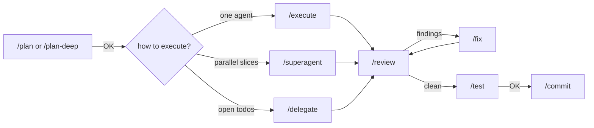

# Claude Code development workflow: step by step

The Claude Code version of [pi-workflow-guide.md](pi-workflow-guide.md). It
uses the same workflow (`claude/CLAUDE.md`, linked to `~/.claude/CLAUDE.md`,
ported from `PI.md`) and the same slash commands (`claude/commands/`, ported
from `pi/prompts/`). This guide covers which command to type at each step,
what you'll see, and what to reply. Only the Claude-specific parts differ
from the pi guide.



Each arrow labelled `OK` is a gate: the agent stops and waits for your reply.

## How pi maps to Claude Code

| pi | Claude Code | Repo → live path |
|---|---|---|
| `PI.md` | `CLAUDE.md` (user memory, loaded into every session) | `claude/CLAUDE.md` → `~/.claude/CLAUDE.md` |
| `pi/prompts/*.md` | Slash commands (`$ARGUMENTS`, `model:` frontmatter) | `claude/commands/` → `~/.claude/commands` |
| pi-model-roles (`smol`/`slow`/`plan`/`commit`/`task`/`web`) | Role subagents. Each `description` routes work to its role, and the `model`/`effort` frontmatter pins the model | `claude/model-roles/<set>/` → `~/.claude/agents` |
| `pi-roles personal\|default` | `claude-roles personal\|default` (repoints the symlink) | `claude/scripts/claude-roles` |
| pi-profile `/profile <name>` | `claude-profile <name>` (a `--settings` overlay applied at launch) | `claude/profiles/*.json` → `~/.claude/profiles` |
| `pi/settings.json` | `~/.claude/settings.json` | `claude/settings.json` |
| `pi/mcp-adapter.json` (Datadog, Jira, Slack) | user-scope MCP servers registered by `claude-mcp-sync` (they live in `~/.claude.json`, which can't be linked); log in with `/mcp` | `claude/mcp.json` |
| shared skills (`~/.agents/skills`, `pi/skills`) | linked one by one into `~/.claude/skills/` (pi-mcp-adapter's pi-only `mcp-scripting` skill is excluded) | — |
| `/todos` | TodoWrite list (`ctrl+t` toggles it) | — |
| `~/.pi/agent/handoffs` | `~/.claude/handoffs` | — |

Profiles and role sets are Anthropic-only (your `/login` subscription). No
`work`/cekat variant exists for Claude Code.

### Token limits

These mirror the cekat work models in `pi/models.json` (GPT-6 Luna / 6.1
Sol: 922K context, 128K output):

- Sonnet 5.5 and Opus 5.5 run with the `[1m]` suffix (1M context window).
- `settings.json` `env` sets `CLAUDE_CODE_MAX_OUTPUT_TOKENS=128000` and
  `CLAUDE_CODE_AUTO_COMPACT_WINDOW=922000`, so auto-compact triggers at the
  same window size the cekat models have.
- Haiku 4.5 is capped at 200K context by the model itself and doesn't take
  an effort setting, so its profiles and agents leave effort out.

### Model profiles

| Profile | Model | Effort |
|---|---|---|
| `default`, `personal-labs` | `claude-sonnet-5-5[1m]` | high |
| `plan`, `slow` | `claude-opus-5-5[1m]` | high |
| `task` | `claude-sonnet-5-5[1m]` | medium |
| `smol`, `commit`, `web` | `claude-haiku-4-5` | — |

```bash
claude-profile              # list profiles
claude-profile plan         # start Claude on Opus 5.5, effort high
ccsmol -p "rename foo"      # aliases: ccp, ccplan, ccslow, ccsmol
```

### Role sets

| Role | `default` set | `personal` set |
|---|---|---|
| smol | haiku-4-5 | sonnet-5-5 / medium |
| slow | sonnet-5-5 / high | opus-5-5 / high |
| plan | sonnet-5-5 / high (read-only tools) | opus-5-5 / high (read-only tools) |
| commit | haiku-4-5 | haiku-4-5 |
| task | sonnet-5-5 / medium | sonnet-5-5 / high |
| web | sonnet-5-5 / medium | haiku-4-5 |

```bash
claude-roles                # show the active set
claude-roles personal       # switch; restart open claude sessions afterwards
```

Slash-command models: `/plan` and `/execute` run on
`claude-sonnet-5-5[1m]`; `/plan-deep` runs on `claude-opus-5-5[1m]` for hard
or high-risk work. All other commands inherit the session model. A command's
`model:` sticks for the rest of the session, so `/execute` pins Sonnet to
switch back after `/plan-deep`. `/commit` stays on the session model
on purpose: a command's `model:` switches the whole conversation, and
Haiku's 200K window can't hold a long 1M-context session. To write the
commit message on Haiku, ask for the `commit` subagent.

## Three kinds of helpers

| Helper | What it is | Where you see it | Use it for |
|---|---|---|---|
| **Subagent** (Agent tool) | A child context in the same Claude process: built-in `Explore`/`general-purpose`, or a role agent (`smol`, `slow`, `plan`, `commit`, `task`, `web`) | Inline in the chat, `/agents` | Read-only exploration, short lookups, role-pinned side tasks |
| **Herdr worker** (`/superagent`, `/delegate`) | A full `claude` session in its own Herdr tab, in a `sa-<id>` workspace | Herdr sidebar, `herdr agent list` | Parallel implementation slices that own disjoint files |
| **You** | — | — | Every gate, every approval or trust dialog, every question a worker raises |

## Step 0: once per machine

`setup.sh` does all of this. To check it took:

```bash
herdr integration status        # claude: current
ls -la ~/.claude                # CLAUDE.md, commands, agents, profiles, settings.json -> repo
claude-roles                    # active set is default
claude-profile                  # lists profiles
```

Inside Claude, `/plan`, `/execute`, `/superagent`, … appear in the slash
menu, and the shared skills (`brainstorming`, `writing-plans`,
`herdr-delegate`, …) appear under `~/.claude/skills/`.

## Step 1: start Herdr, then Claude

```bash
cd ~/Artifacts/labs/src/<project>
herdr                           # launches or re-attaches the persistent session
claude                          # in the Herdr pane (or `claude-profile <name>`)
```

- `/superagent` and `/delegate` only work inside Herdr (`HERDR_ENV=1`).
- Answer Claude's "Do you trust the files in this folder?" dialog first.
  Herdr reports it as idle, so a worker started in an untrusted folder would
  have its prompt typed into that dialog. The delegate skill checks each
  worker's screen before dispatching, but trusting the folder up front
  avoids the problem.
- Herdr keys are the same as in the pi guide (`prefix+w`, `prefix+n/p`,
  `prefix+q`, …).

## Step 2: plan

```text
/plan Add a /health endpoint and a status badge in the UI, with an E2E test
/plan-deep Redesign the auth flow          # same steps, on Opus 5.5
```

`/plan` runs on Sonnet 5.5; `/plan-deep` runs on Opus 5.5. It reads the repo, may ask you questions with
AskUserQuestion, ends with a plan, and **stops**. Reply `OK`. For a big
plan, ask it to list **files per step**, since that decides whether the
work can be parallelized. You can also use plan mode (`shift+tab`) for a
written plan file.

## Step 3: choose how to execute

| Situation | Type |
|---|---|
| Small change, or steps that touch the same files | `/execute <the approved plan>` |
| Two or more steps that touch **different** files | `/superagent <the approved plan>` |
| You already collected the work as session todos | `/delegate` |

To ask for a subagent explicitly: `Use the Explore agent to find every
caller of fetchStatus, then continue.` or `@agent-smol rename foo to bar`.

## Step 4a–4c: execute, superagent, delegate

These steps are the same as the pi guide, with these differences:

- `/execute` tracks steps with TodoWrite (`ctrl+t`) instead of `/todos`.
- `/superagent` starts **`claude` workers** (`herdr agent start --kind
  claude`) when the orchestrator is Claude. pi and omp orchestrators still
  start their own kind. Name a model to override it, e.g.
  `… workers on claude-opus-5-5`.
- Claude has no `sa ●` footer. Watch the Herdr sidebar or run
  `herdr agent list` / `herdr agent read sa-<id>-N --lines 60`.
- `/delegate` turns the open TodoWrite items into slices labelled
  `todo#<n>`. Each one is marked completed only after its worker is verified.
- Workers inherit `~/.claude/settings.json` (and its permission rules). A
  worker waiting on a tool-permission prompt shows as **blocked**, and you
  answer it in that worker's tab, the same as in the pi guide's
  [Blocked workers](pi-workflow-guide.md#blocked-workers).

## Steps 5–8: review, fix, test, commit

These work the same as in the pi guide: `/review [focus]` → `/fix
<findings>` (max two rounds) → `/test [extra checks]` → `/commit`. Nothing
is staged until you reply `yes` to `/commit`.

## Step 9: stopping mid-way (handoff)

```text
/do-handoff health endpoint        # writes ~/.claude/handoffs/YYYY-MM-DD-handoff-health-endpoint.md
/handoff                           # lists active handoffs, archives status: done ones
/work-on-handoff 2026-10-08-handoff-health-endpoint.md
```

## Statusline

`claude/scripts/claude-statusline` (linked to `~/.local/bin` by `setup.sh`,
selected by `statusLine` in `settings.json`) is a two-line, pi-style footer:

```text
dotfiles-macos main ●3 ↑1 │ Sonnet 5.5 · high │ $1.23
ctx ▰▰▰▰▱▱▱▱▱▱ 42% 392k/922k │ CPU 12% MEM 79% │ roles:default · MCP 2
```

`●n` = changed files, `↑/↓` = ahead/behind upstream. Context, CPU and MEM turn
yellow then red as they climb. Missing data shows `–`, so the height never
changes. tps, subagent count and plan mode aren't shown — the statusline JSON
doesn't expose them. Needs `jq`; the MCP count reads `~/.claude.json`; git
status is cached for 5 s.

## Troubleshooting

| Symptom | Cause / fix |
|---|---|
| `/plan`, `/plan-deep` etc. missing from the slash menu | `~/.claude/commands` isn't linked. Re-run `setup.sh` |
| Role agents missing from `/agents` | No set linked. Run `claude-roles default` and restart Claude |
| `~/.claude/settings.json` is a regular file again | Something replaced the symlink when it saved. Copy it back with `cp ~/.claude/settings.json claude/settings.json`, review with `git diff`, then re-run `setup.sh` |
| Orca/Herdr hook changes show up in `git diff claude/settings.json` | Expected: settings.json is linked wholesale. Commit them or revert them deliberately |
| Workers start pi instead of claude | The orchestrator pane isn't registered as `claude`. Check `herdr agent get "$HERDR_PANE_ID"` and `herdr integration status` |
| Haiku profile errors about effort | Haiku 4.5 has no effort setting. Keep `effortLevel` out of Haiku profiles |
| Statusline blank or missing | `~/.local/bin/claude-statusline` isn't linked or `jq` is missing. Re-run `setup.sh`; test with `echo '{}' \| claude-statusline` |
