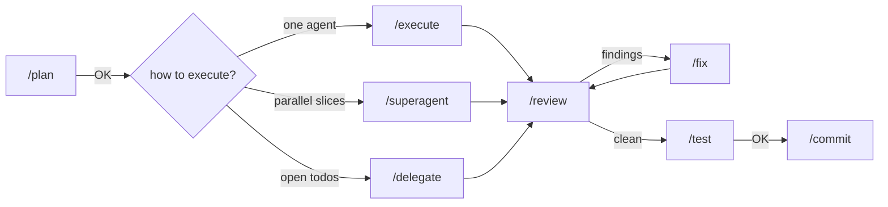

# pi development workflow: step by step

How to drive the existing workflow (`PI.md`, linked to `~/.pi/agent/PI.md`)
from a terminal: which command to type at each step, what you'll see, and what
to reply. Every prompt is annotated in [pi-prompts.md](pi-prompts.md).



Each arrow labelled `OK` is a gate: the agent stops and waits for your reply.

## Three kinds of helpers

| Helper | What it is | Where you see it | Use it for |
|---|---|---|---|
| **Subagent** (`Agent` tool, pi-subagents) | A child session inside the same pi process (`Explore`, `Plan`, `general-purpose`, or a custom agent) | Inline in the chat, the widget above the editor, FleetView (`↓` at an empty prompt), `/agents` | Read-only exploration and short lookups while you plan or execute |
| **Herdr worker** (`/superagent`, `/delegate`) | A full pi/omp session in its own Herdr tab, in a `sa-<id>` workspace | Herdr sidebar, the `sa ●/◐/✓` footer in the orchestrator, `/herdr-agents` | Parallel implementation slices that own disjoint files |
| **You** | — | — | Every gate, every approval or trust dialog, every question a worker raises |

PI.md routes work this way: subagents for read-only lookups, Herdr workers only
when you ask for parallel or delegated work. Neither may decide anything that
needs your approval.

## Step 0: once per machine

`setup.sh` does all of this. To check it took:

```bash
herdr --version                 # 0.9.x
herdr integration status        # pi: current, omp: current
ls ~/.omp/agent/skills          # herdr  herdr-delegate
```

Inside pi, the prompts show up as `/plan`, `/execute`, `/superagent`, … and
`/skill:herdr-delegate` loads.

## Step 1: start Herdr, then pi

```bash
cd ~/Artifacts/labs/src/<project>
herdr            # launches or re-attaches the persistent session
pi               # in the Herdr pane (or `omp`)
```

- `/superagent` and `/delegate` only work inside Herdr (`HERDR_ENV=1`). Plain
  `/plan`, `/execute`, and subagents work anywhere.
- Trust the project in pi first (the "Trust project folder?" dialog) if it has
  a `.pi/` directory. Workers started later inherit that trust; see
  [Blocked workers](#blocked-workers) for why this matters.
- Herdr's default prefix is `ctrl+b` (same as tmux, so don't run Herdr inside tmux).
  Useful defaults: `prefix+w` workspace picker, `prefix+n` / `prefix+p`
  next/previous tab, `prefix+1..9` jump to tab, `prefix+b` toggle sidebar,
  `prefix+q` detach (everything keeps running), `prefix+?` help.

## Step 2: plan

```text
/plan Add a /health endpoint and a status badge in the UI, with an E2E test
```

The agent reads the repo and may ask you to choose between options. It ends
with a plan and **stops**. It may use an `Explore` subagent to scan unfamiliar
code; you'll see it inline or in FleetView.

Reply `OK` (or ask for changes). For a big plan, ask it to list
**files per step** — that's what decides whether the work can be parallelized.

## Step 3: choose how to execute

| Situation | Type |
|---|---|
| Small change, or steps that touch the same files | `/execute <the approved plan>` |
| Two or more steps that touch **different** files and can run at the same time | `/superagent <the approved plan>` |
| You already collected the work as session todos | `/delegate` |

Subagents are not a separate choice here: `/execute` may still spawn an
`Explore` subagent for a lookup. Ask for one explicitly any time:

```text
Use an Explore subagent to find every caller of fetchStatus, then continue.
```

or address one directly at the prompt: `@explore where is the router defined?`

## Step 4a: `/execute` (one agent)

```text
/execute the approved plan above
```

It implements test-first for behavior changes, tracks steps with `todo`
(`/todos` to view), and ends with a summary plus targeted test output. It does
not commit. Next: [Step 5](#step-5-review).

## Step 4b: `/superagent` (parallel Herdr workers)

```text
/superagent the approved plan above
```

1. **Slice table.** The orchestrator prints one row per worker:

   ```text
   | Worker | Owned files              | Goal                 | Validation          |
   |--------|--------------------------|----------------------|---------------------|
   | 1      | src/server/health.ts ... | /health endpoint     | npm test -- health  |
   | 2      | src/ui/StatusBadge.tsx … | status badge         | npm test -- Badge   |
   ```

   Check that no file appears in two rows and that each validation command is
   real. If the plan wasn't approved in this conversation, it stops here;
   reply `OK`.
2. **Workers start.** A new workspace `sa-<id>` appears in the Herdr sidebar
   with one tab per worker (`sa-<id>-1`, `sa-<id>-2`, …). Your focus stays on
   the orchestrator.
3. **Watch.** The orchestrator's footer updates every 3 s:
   `sa ● 2 working` → `sa ● 1 working · ✓ 1 ready` → `sa ✓ 2 ready`.
   `/herdr-agents` lists every agent with its status. To look at a worker:
   `prefix+w`, pick `sa-<id>`, then `prefix+n`/`prefix+p` between tabs. Don't
   type into a worker while it runs.
4. **Verify.** When all are done, the orchestrator checks that only owned files
   changed, re-runs every worker's validation command itself, and prints:

   ```text
   | Worker    | Tab       | Status | Changed files | Validation |
   ```

5. **Cleanup.** If every worker finished, it closes the `sa-<id>` workspace.
   Otherwise it leaves it open and prints the workspace ID and worker names.
   Briefs and results stay in `$TMPDIR/superagent/<id>/` for later reading.

Next: [Step 5](#step-5-review).

## Step 4c: `/delegate` (todos to workers)

```text
add todos: add /health endpoint; add status badge; add E2E test for the badge
/todos                      # check them; Space toggles, Esc closes
/delegate keep the existing API client
```

Same flow as `/superagent`, but each row is labelled `todo#<id>`, and each todo
gets ticked off only after its worker is verified. Todos that share files are
merged into one worker.

## Blocked workers

A worker is blocked when it's waiting at a question or approval dialog.

1. The orchestrator shows `Warning: herdr: sa-<id>-2 is blocked — herdr agent
   read sa-<id>-2` and the footer gains `◐ 1 blocked`.
2. Read it without switching: `herdr agent read sa-<id>-2 --lines 60`
   (from a spare pane: `prefix+v` splits one).
3. Answer it yourself in that worker's tab (`herdr agent focus sa-<id>-2`).
   The orchestrator never answers approval or trust dialogs.
4. Go back to the orchestrator and tell it what you decided, e.g.
   `resolved sa-<id>-2's question: keep the old schema; continue`.

If a worker reports `status: blocked` in its result (it hit a decision it may
not take), the orchestrator relays the question to you. Answer it in the
orchestrator chat.

**Trust dialog caveat.** Herdr reports pi's "Trust project folder?" dialog as
`idle`, not blocked, and a prompt sent to it would press Enter on **Trust**.
The delegate skill reads every worker's screen before sending its prompt and
stops if it sees a dialog. Trusting the project in Step 1 avoids the dialog
entirely.

## Step 5: review

```text
/review
/review focus on error handling in the health endpoint
```

Read-only. Findings come with severity, file:line, impact, and a fix; blocking
findings are separated from suggestions. It stops and waits for you.

## Step 6: fix (if there are findings)

```text
/fix findings 1 and 3; skip 2, it's intended
```

Each finding is checked against the code first; confirmed behavior fixes get a
failing test first. It ends with fixed / not applicable / blocked per finding,
then hands back to `/review`. Run review → fix at most twice; if blocking
findings remain after that, decide yourself.

## Step 7: test

```text
/test
/test include the Playwright E2E suite
```

Runs the project's real checks: tests, lint, build or type checks, and a
smoke check of the changed path. This is where end-to-end tests belong: the
full app has to be running, so they can't be checked inside a single worker's
slice. It reports every command with its output and stops at the gate:
diff summary + test output.

## Step 8: commit

```text
/commit
```

Shows the conventional commit message, the exact files, and the evidence, then
asks. Reply `yes` to stage and commit; nothing is staged before that. Workers
and the orchestrator never commit.

## Step 9: stopping mid-way (handoff)

```text
/do-handoff health endpoint
```

Writes `~/.pi/agent/handoffs/YYYY-MM-DD-handoff-health-endpoint.md` (Context,
Done, Remaining, Next step, Files, Validation). In a later session:

```text
/handoff                                              # lists active handoffs
/work-on-handoff 2026-10-07-handoff-health-endpoint.md
```

When the work is finished it sets `status: done`; the next `/handoff` moves it
to `_archived/`.

## End-to-end example

A full run for one feature, from empty prompt to commit. The paths are
illustrative.

1. **Start**: `cd ~/Artifacts/labs/src/shop && herdr`, then `pi` in the pane.
2. **Plan**:
   `/plan Add GET /health returning {status, version}; show a green/red badge in the header; cover it with an E2E test`.
   The agent asks: "poll the endpoint or fetch once on load?" Pick one. It
   returns a plan:
   - Step 1 `src/server/health.ts`, `src/server/health.test.ts`
   - Step 2 `src/ui/StatusBadge.tsx`, `src/ui/StatusBadge.test.tsx`,
     `src/ui/Header.tsx`
   - Step 3 `e2e/health.spec.ts`
   - Validation: `npm test`, `npx playwright test e2e/health.spec.ts`

   Reply `OK`.
3. **Execute in parallel**: the three steps touch different files, so:
   `/superagent the approved plan above`. The plan was approved in this
   conversation, so it prints the slice table (three workers) and starts them
   without stopping again. The E2E worker's validation is "file type-checks"
   because the full E2E run needs both other slices.
4. **Watch**: the footer goes `sa ● 3 working` → `sa ✓ 3 ready`. Worker 2
   blocks on a question ("Header.tsx already imports a Badge — rename?");
   the orchestrator relays it; you answer `rename to HealthBadge`, and it
   passes your answer to that worker, which finishes its slice.
5. **Integrate**: the orchestrator confirms only owned files changed, re-runs
   each worker's validation, prints the summary table, and closes `sa-<id>`.
6. **Review**: `/review` → one blocking finding (no timeout on the health fetch).
7. **Fix**: `/fix finding 1` → failing test, fix, pass. `/review` again → clean.
8. **Test**: `/test include the Playwright E2E suite` → unit tests, lint,
   build, `npx playwright test` all pass; smoke: `curl localhost:3000/health`.
   Reply `OK`.
9. **Commit**: `/commit` → `feat: add health endpoint and header status badge`
   with the file list. Reply `yes`.

## Troubleshooting

| Symptom | Cause / fix |
|---|---|
| `/superagent` says it isn't running inside Herdr | Start `herdr` first, then `pi` in its pane |
| No `sa …` footer | Only shown while `sa-*` workers exist, and only in the orchestrator (not in workers) |
| `sa-<id>` workspace left open | A worker didn't finish. Read its result in `$TMPDIR/superagent/<id>/`, then close it with `herdr workspace close <WS_ID>` (the `w…` ID the orchestrator printed; `herdr workspace list` shows it) or `prefix+shift+d` |
| Orchestrator reports a path changed outside owned files | A worker overstepped. Review that file's diff before accepting |
| A worker is sitting at "Trust project folder?" | Answer it yourself in that tab, then tell the orchestrator to continue |
| Workers use the wrong model | They use your active pi profile. Name a model in the request (`… workers on <provider/id>`) |
